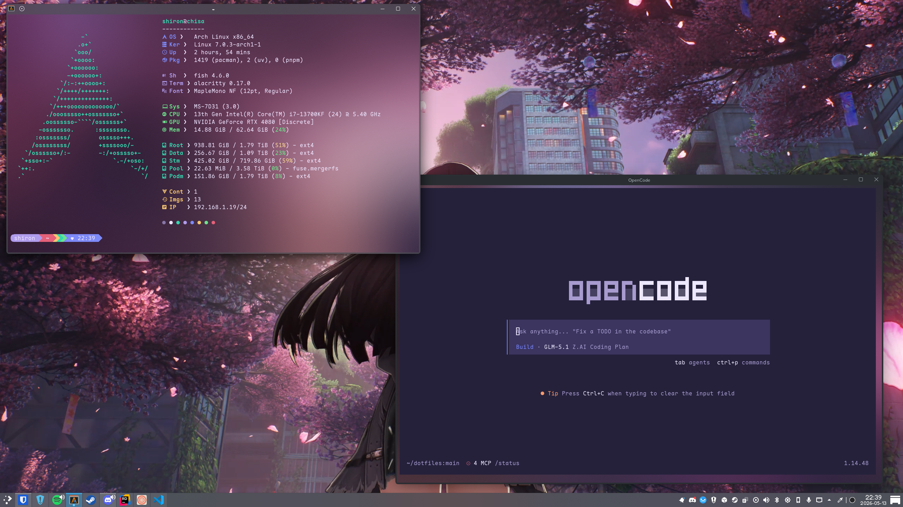

# Dotfiles

Personal configuration for an Arch Linux workstation with KDE Plasma, managed via GNU Stow.

Daily drivers:
- **Desktop**: i7-13700KF, RTX 4080
- **Laptop**: Asus Vivobook S16, Ryzen AI 9 365, Radeon 880M

## Preview



## Modules

### alacritty

Terminal emulator configuration.

- Window: 115x30, 8px padding, 30% opacity with blur, full decorations
- Font: MapleMono NF at 12pt
- Shell: fish
- Cursor: blinking beam
- Colors: Lavi theme (imported from `lavi.toml`)

### ghostty

Terminal emulator configuration (alternative to Alacritty).

- Window: 115x30, 8px padding, 30% opacity with blur
- Font: MapleMono NF at 12pt
- Shell: fish
- Cursor: blinking bar
- Theme: Lavi (custom `lavi.conf`)

### fish

Shell configuration (`config.fish`).

- Initializes Starship prompt
- Runs fastfetch on startup
- Aliases `docker` to `podman`
- Adds `~/.local/bin` to `$PATH` (for uv)
- Sets `$PNPM_HOME` and adds it to `$PATH`
- Activates mise
- Adds `~/.opencode/bin` to `$PATH`

### starship

Shell prompt configuration (`starship.toml`).

- Powerline-style prompt with colored segments
- Segments: username, directory, git branch, git status, language version (C, C++, Elixir, Elm, Go, Gradle, Haskell, Java, Julia, Node.js, Nim, Rust, Scala), Docker context, time
- Directory substitutions (Documents, Downloads, Music, Pictures)
- 24-hour time display

### fastfetch

System information dashboard (`config.jsonc`).

Displays: OS, kernel, uptime, package counts (pacman, uv, pnpm), shell, terminal, font, host, CPU, GPU, memory, disk usage (root, /mnt/data, /mnt/steam, /mnt/media, /mnt/docker), Podman container and image counts, local IP, color palette

### kde

KDE Plasma desktop configuration.

- **kdeglobals**: Purple accent (`#926EE4`), Klassy widget style, Fredoka font (UI), Maple Mono (fixed), Papirus-Dark icons, Klassy Kit Dark bottom panel look-and-feel
- **kwinrc**: Single virtual desktop, tiling layout with 25/50/25 horizontal split (4px padding), window buttons: left (minimize, fullscreen, shade), right (help, keep above, keep below, maximize, close)
- **plasma-org.kde.plasma.desktop-appletsrc**: Bottom panel with Kickoff launcher, pager, icon tasks, system tray (KDE Connect, vault, keyboard, screen, camera, notifications, clipboard, network, keyboard layout, device notifier, weather, printing, volume, brightness, battery, Bluetooth, media controller), color picker, digital clock (24h, ISO date, week numbers), show-desktop button. Wallpaper Engine plugin on both monitors
- **plasma-localerc**: `en_US.UTF-8` with `de_DE` measurement and paper formats

### podman

Container engine configuration.

- `storage.conf`: overlay storage driver
- `containers.conf`: volume path set to `/mnt/docker/volumes`

### server

Self-hosted service definitions and systemd management.

- **forgejo/**: Podman Compose stack for Forgejo 14 (port 3000 HTTP, port 3001 SSH, named volume for data)
- **docker-compose@.service**: Systemd template unit that runs `docker-compose up -d` per service from `~/.config/services/<name>/`, loads secrets from `~/.local/share/secrets/<name>.env`

### easy-effects

Audio processing presets for Audio-Technica ATH-M50X.

- **Input**: Noise gate (threshold -50 dB) → DeepFilterNet noise suppression → high-pass filter (80 Hz) → stereo tools (mono left) → limiter (threshold -0.5 dB)
- **Output**: 4-band EQ (low shelf +3 dB at 60 Hz, bell -2 dB at 250 Hz, bell +1.5 dB at 4 kHz, high shelf +2 dB at 8 kHz; input gain -7.1 dB) → bass enhancer (amount 6.5) → limiter (threshold -0.5 dB). Blocklist: Unrailed 2, Among Us, plasmashell

### opencode

CLI coding agent configuration.

- **opencode.json**: Explore agent configured with subagent mode. MCP servers defined (all disabled by default): HeroUI Native, Obsidian vault, JetBrains Rider, shadcn, Playwright, Avalonia UI
- **AGENTS.md**: Coding conventions document (C#/.NET naming, project structure, backend/frontend patterns, testing, performance, documentation)
- **themes/lavi.json**: Custom Lavi theme (purple/dark color scheme)
- **commands/**: Six custom commands:
  - `commit` — Analyzes changes and creates a conventional commit
  - `create-tests` — Generates unit tests for a specified scope
  - `create-note` — Expands a rough idea into an Obsidian brain-dump note
  - `create-documentation` — Generates a README via parallelized codebase analysis
  - `create-obsidian-wiki` — Converts HTML to Markdown and saves to Obsidian vault
  - `migrate-db` — Analyzes model changes and creates an EF Core migration

## Package Lists

> [!WARNING]
> These lists replicate a full system 1:1. Read through them before installing — you will not need everything.

| File | Contents |
|---|---|
| `pkglist-repo.txt` | Official Arch repo packages |
| `pkglist-aur.txt` | AUR packages |
| `pkglist-nvidia.txt` | NVIDIA driver packages |

## Scripts

`install-paru.sh` — Bootstraps the `paru` AUR helper from source (installs `base-devel` and `git`, clones and builds paru).

## Structure

```
.
├── alacritty/        # Terminal emulator (Alacritty)
├── ghostty/          # Terminal emulator (Ghostty)
├── easy-effects/     # Audio processing presets
├── fastfetch/        # System info dashboard
├── fish/             # Shell config
├── kde/              # Plasma desktop, KWin, color scheme
├── opencode/         # CLI coding agent config, commands, theme
├── podman/           # Container engine config
├── server/           # Service compose files and systemd units
├── starship/         # Shell prompt
├── pkglist-repo.txt  # Official Arch packages
├── pkglist-aur.txt   # AUR packages
├── pkglist-nvidia.txt
└── install-paru.sh   # AUR helper bootstrap
```

## Usage

Clone and symlink configurations with Stow:

```bash
git clone <repo-url> ~/.dotfiles
cd ~/.dotfiles
stow alacritty ghostty easy-effects fastfetch fish kde opencode podman server starship
```

Install all tracked packages:

```bash
# Official repos
sudo pacman -S --needed - < pkglist-repo.txt

# AUR (requires paru or similar helper)
paru -S --needed - < pkglist-aur.txt
```

Bootstrap the AUR helper:

```bash
bash install-paru.sh
```

Enable a self-hosted service:

```bash
systemctl --user enable --now docker-compose@forgejo
```

## Themes Used

### [Lavi](https://github.com/b0o/lavi)
Used for Alacritty, Ghostty and OpenCode

## License

MIT
